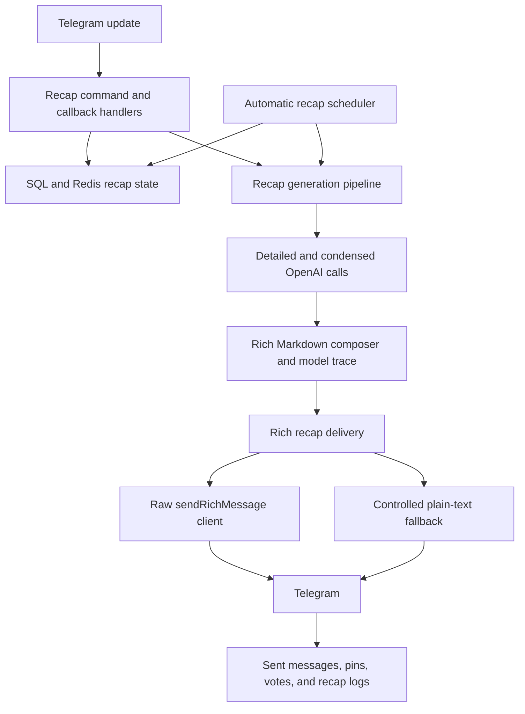
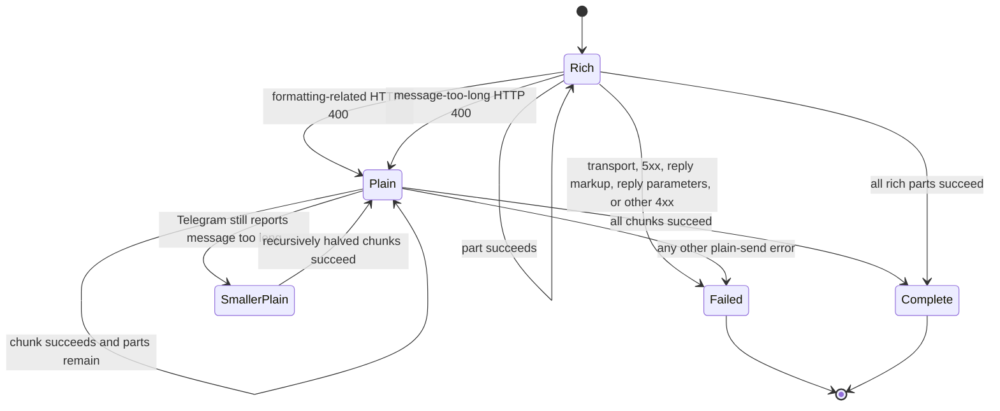

# Go Rich Message Recap Parity Design

## Status and source of truth

This specification ports the Telegram Rich Message recap domain from the Go
repository into this Rust repository without redesigning its observable
behavior first.

The source of truth is:

- Repository: `insights-bot-go`
- Release: `v1.0.0`
- Commit: `02aee8ce260165592e2152eb5a024a602e4eced1`

When the existing Rust behavior conflicts with that Go release, the Go
behavior wins unless an exclusion is stated below. Rust implementation details
may use idiomatic types and async APIs, but the Telegram requests, state
transitions, thresholds, scheduling, persistence effects, model selection,
fallback behavior, and user-visible results must remain equivalent.

The user's secret and personal-data safety gate overrides mechanical failure
parity. The Rust port does not reproduce unconditional chat-content logging,
infinite token-splitting loops, or process panics caused by missing persisted
defaults or malformed custom prompt templates. Those cases return bounded,
redacted errors while valid production behavior remains unchanged.

## Scope

### Included

The port includes the complete Telegram recap feature chain that produces or
controls Rich Message recaps:

- `/recap`, including group and supergroup validation, feature enablement,
  manual rate limiting, public mode, private-subscription mode, the six hour
  choices `1`, `2`, `4`, `6`, `12`, and `24`, callback payload expiry, waiting
  messages, and cleanup.
- `/configure_recap`, including administrator checks, recap enablement,
  public/private delivery mode, automatic recap rates `2`, `3`, and `4` times
  per day, pinning, completion, and all matching callback actions.
- `/recap_forwarded_start`, `/recap_forwarded`, and `/cancel`, including the
  two-hour Redis session, active-session text and caption capture including
  forwarded messages, Redis-score-ordered replay, five-message minimum,
  waiting-message cleanup, and completion message.
- `/subscribe_recap`, `/unsubscribe_recap`, `/start` deep-link continuation,
  inline unsubscribe callbacks, automatic private delivery, and automatic
  removal of a departed member's subscription.
- Automatic recap scheduling, public and private-subscriber targets,
  per-target keyboards, rate limiting, partial-send persistence, first-message
  pinning, previous-message unpinning, and sent-message tracking.
- Recap feedback reactions and their callback keyboard state.
- Telegram chat/message capture needed by recap generation, including edits,
  replies, chat metadata, chat migration, deletion, and message timestamps.
- Detailed recap generation, sarcastic condensed generation, primary and
  backup model chains, conditional `CHECK_MODEL` repair, configured summary
  language, configured token limits, actual response-model provenance, usage
  metrics, and recap logs.
- Rich Markdown sanitization, controlled Telegram references, model trace
  rendering, Rich Message composition, UTF-16 splitting, raw
  `sendRichMessage` transport, continuation replies, inline-keyboard placement,
  controlled plain-text fallback, recursive fallback splitting, and partial
  delivery reporting.
- PostgreSQL and SQLite schema parity for the recap domain, Redis state used by
  the recap domain, locale entries, `.env.example`, README documentation, and
  focused tests.

### Excluded

- `/smr`, webpage summarization, its retry callback, its prompts, and its
  normal generation, storage, and delivery flow. The only exception is the
  narrow recap-button compatibility path for
  `smr/summarization/feedback/react`, including the table operation and
  message-edit behavior described below.
- Slack and Discord recap delivery.
- Telegram features unrelated to chat-history recaps.
- Behavior changes, cleanup refactors, or product adjustments that are not
  required for Go `v1.0.0` parity.

## Definition of 1:1 parity

Parity is evaluated at observable boundaries. Given equivalent configuration,
database rows, Redis entries, Telegram updates, and model responses, the Rust
bot must:

1. expose the same recap commands and callback transitions;
2. accept and reject the same chat types, permissions, thresholds, and states;
3. construct equivalent prompts, references, summaries, model traces, buttons,
   and Telegram request payloads;
4. apply the same retry, backup-model, fallback, cleanup, pinning, persistence,
   scheduling, and error rules; and
5. leave equivalent SQL and Redis state after success, partial success,
   cancellation, expiration, and failure.

The Go tests provide literal expectations where they exist. Missing coverage is
filled with Rust characterization tests derived directly from Go production
branches before their Rust implementations are added.

User-visible command descriptions, prompts, waiting/completion messages,
errors, button labels, and model-trace text are copied byte-for-byte from the
Go release, including its existing mix of Simplified and Traditional Chinese.
Rust locale keys may organize those literals, but locale cleanup or wording
changes are deferred until after parity.

## Architecture

Teloxide remains the update dispatcher and the implementation keeps SQLx for
PostgreSQL and SQLite. Those substitutions do not change the Go behavior.
Redis is added for recap state whose expiry and sorted-set behavior are part of
the Go contract. A small raw Telegram Bot API client is added because teloxide
does not currently expose the Bot API 10.1+ Rich Message methods.



### Component mapping

| Go source | Rust responsibility |
| --- | --- |
| `pkg/bots/tgbot/rich_message.go` | Raw `sendRichMessage` request/response and Telegram API errors |
| `internal/services/recapdelivery` | Multi-part Rich Message delivery and plain fallback state machine |
| `internal/models/chathistories/rich_recap*.go` | Escape, sanitize, reference, compose, split, and visible summary helpers |
| `internal/models/chathistories/model_trace.go` | Final accepted model provenance footer |
| `internal/thirdparty/openai` and recap generation models | Primary/backup/CHECK execution and usage traces |
| `internal/bots/telegram/handlers/recap` | Commands, callbacks, permissions, subscription, forwarded, and feedback behavior |
| `internal/models/tgchats` | Enablement, mode, frequency, pin, subscriber, and schedule state |
| `internal/services/autorecap` | Scheduled generation, target fan-out, keyboard, pin, and persistence behavior |
| Ent recap schemas and Redis keys | SQLx migrations/repositories and Redis keys with equivalent semantics |

## Raw Telegram wire contract

Rich delivery sends an HTTP `POST` to
`<telegram-api-base>/bot<TOKEN>/sendRichMessage` as
`application/x-www-form-urlencoded`. The form contains decimal `chat_id`, a
JSON-encoded `rich_message` value with exactly one `markdown` field, optional
JSON-encoded `reply_parameters`, optional JSON-encoded `reply_markup`, and
`disable_notification=true` only when enabled. Nil optional objects and false
optional booleans are omitted rather than serialized as JSON `null` or false
form values. `reply_parameters` always carries `message_id`, optionally carries
a nonzero `chat_id`, and only includes `allow_sending_without_reply=true` when
enabled. The response must be decoded as a Telegram `Message`, including the
returned message ID used by continuation replies and sent-message persistence.

`TELEGRAM_BOT_API_ENDPOINT` is the base before `/bot<TOKEN>/<method>` and is
shared by ordinary teloxide requests and the raw Rich Message client. Tests
capture the exact path, content type, form values, optional-field omission,
Telegram error code, and Telegram error description.

## Rich Message content contract

Detailed prompt rows render exactly as
`msgId:<virtual>: <actor> sent: <text>`. A reply snapshot receives the next
interleaved virtual ID and renders as
`msgId:<virtual>: <actor> replying to [<reply-actor> sent msgId:<reply-virtual>]: <text>`.
Virtual IDs start at one and never mutate stored message IDs. For these detailed
group rows only, a full name with at least ten Unicode scalar values uses its
non-empty username; otherwise every `#` is removed from the full name.
Condensed group rows choose non-empty `FullName`, then `Username`, then
`未知用戶`; they do not apply the detailed-row name transformation. They render
as `[<original-index + 1>] <actor>: <text>\n`; empty text is skipped without
renumbering later rows. Forwarded detailed rows use each stored replay
`MessageID` directly as `msgId`, while forwarded condensed input renders as
`<ActorDisplayName-or-ActorUsername>: <text>\n` without an index prefix or an
unknown-user fallback.

The model may return `{{tg-ref:...}}` markers. Positive mapped virtual IDs are
accepted in marker order and deduplicated by resolved real message ID, with at
most five references per marker. Each marker numbers its own links from `[1]`.
Invalid, unknown, non-positive, and duplicate real IDs disappear. Only a
supergroup produces `https://t.me/c/<internal-chat-id>/<real-message-id>` links,
where only the leading `-100` is removed from the source chat ID. Markers
disappear for private chats and ordinary groups; ordinary groups receive the
Go general-group notice.

Sanitization removes model-authored HTML tags while preserving visible text,
replaces inline links and images with their labels, removes bare HTTP(S) URLs,
removes fence delimiter lines while retaining fenced body text, and strips
live ASCII username-mention prefixes without altering email addresses.
Detailed sanitization flattens leading blockquotes, rewrites `* ` list markers
to `- `, and escapes every table pipe. Condensed sanitization rewrites `* ` to
`- `, rewrites leading `# ` or `## ` headings to `### `, and leaves table
pipes unchanged.

The visible Rich Markdown prefix preserves the Go order:

1. escaped recap title;
2. automatic or initiating-user metadata;
3. optional private-subscription notice;
4. `## 濃縮總結` and the accepted condensed summary;
5. optional ordinary-group reference notice;
6. divider and model execution trace; and
7. collapsible `<details><summary>詳細總結</summary>` content.

The condensed summary uses the Go primary and backup chain. Structural repair
through `CHECK_MODEL` and its backup chain occurs only when the condensed Rich
Markdown is invalid. Generation and Check traces record the actual response
`model` for their respective stages; the footer retains the candidate source
and repair source separately as defined below. If condensed generation fails or
is empty, the deterministic 120 UTF-16-unit fallback is derived from detailed
summaries without cutting protected spans.

Before condensed sanitization, the display helper removes one leading
`濃縮總結` or `浓缩总结` label, optional surrounding bold markers, an optional
colon, and an optional robot emoji. If that removal would leave no text, the
original trimmed summary remains. The model footer is exactly five quote lines:
`> **模型資訊**`, a blank quote line, and the `濃縮總結`, `詳細總結`, and
`Check` rows. Successful calls prefer the non-empty API response model and use
the requested model only when the response omits it. A configured but
unattempted Check displays its configured primary model, an absent Check
displays `未設定`, and a failed path without a successful source displays
`資訊不可用`. Detail-slice model names merge without duplicates. Check repair
retains the model that produced the repaired condensed candidate and lists the
actual repair model separately.

Valid condensed output is one non-empty line. Code fences, JSON objects or
arrays, multiple non-empty lines, headings, and unordered-list items beginning
with `- ` or `* ` are rejected. Inline bold, italic, and code remain valid.
Generation order is condensed primary, condensed backups in configured order,
then conditional Check repair of the last invalid candidate. Check backups run
only after the primary Check request fails, is empty, or remains invalid.

Rich output is limited to 32,768 UTF-16 code units per part. Splitting prefers
Markdown block and sentence boundaries, preserves complete links and inline
spans when possible, wraps every detailed part in a complete details block,
and replies every continuation part to the first successfully delivered
message. Condensed-only output is split without a details wrapper, while empty
condensed and detailed input yields no parts. If an oversized condensed prefix
leaves no room for the first details body, standalone Rich parts carry the
condensed content first; later detailed parts each receive the complete
`<details><summary>詳細總結</summary>\n\n...\n\n</details>` wrapper.

## Configuration contract

The port reads the Go variable names with exact casing:

```text
TELEGRAM_BOT_TOKEN
TELEGRAM_BOT_API_ENDPOINT
REDIS_HOST
REDIS_PORT
REDIS_TLS_ENABLED
REDIS_USERNAME
REDIS_PASSWORD
REDIS_DB
REDIS_CLIENT_CACHE_ENABLED
HARD_LIMIT_MANUAL_RECAP_RATE_PER_SECONDS
OPENAI_API_SECRET
OPENAI_API_HOST
OPENAI_API_MODEL_NAME
OPENAI_API_MODEL_NAME_backup
OPENAI_API_TOKEN_LIMIT
OPENAI_API_CHAT_HISTORIES_RECAP_TOKEN_LIMIT
SARCASTIC_CONDENSED_MODEL_NAME
SARCASTIC_CONDENSED_MODEL_NAME_backup
SARCASTIC_CONDENSED_SYSTEM_PROMPT
SARCASTIC_CONDENSED_USER_PROMPT
CHECK_MODEL
CHECK_MODEL_backup
CHAT_HISTORIES_SUMMARIZATION_LANGUAGE
OPENAI_FORCE_CHECK_MODEL_FAILURE
OPENAI_FORCE_CONDENSED_PRIMARY_FAILURE_FOR_TEST
OPENAI_VERBOSE_PAYLOAD_LOGS
TIMEZONE_SHIFT_SECONDS
AUTO_RECAP_TEST_ENABLED
AUTO_RECAP_TEST_CHAT_ID
```

Comma-separated backup lists are trimmed, empty values and duplicates are
removed, order is retained, and the primary model is removed from its backup
list. `CHECK_MODEL_backup` has no effect without `CHECK_MODEL`. The Go defaults
are `gpt-3.5-turbo`, total token limit `4096`, recap reserve `2000`, and summary
language `Simplified Chinese`; an unset condensed model uses the detailed
primary model. Boolean test and verbose switches accept only `true` or `1`.
The custom Telegram API endpoint is used for both teloxide and raw Rich Message
requests.

A non-empty `SARCASTIC_CONDENSED_SYSTEM_PROMPT` replaces only the condensed
system message. A non-empty `SARCASTIC_CONDENSED_USER_PROMPT` is compiled with
Go-compatible `text/template` behavior and receives only `ChatHistory`; empty
values retain the pinned defaults. Detailed and Check prompts remain fixed.
Rust validates the custom user template while loading configuration and
returns the bounded configuration error described below instead of reproducing
the Go template panic.

`OPENAI_API_SECRET` is canonical; the existing Rust `OPENAI_API_KEY` alias may
remain as a fallback only when `OPENAI_API_SECRET` is absent. The manual limit
is parsed as seconds, negative or invalid values become zero, and a persisted
per-chat value overrides it only when the persisted value is larger. Redis
TLS and client-cache booleans use the same `true` or `1` rule, and `REDIS_DB`
falls back to zero when absent, invalid, or negative.

When `AUTO_RECAP_TEST_ENABLED` is true and `AUTO_RECAP_TEST_CHAT_ID` is
nonzero, startup still queues normal schedules and also launches one immediate
automatic recap for that chat through the production handler. The two OpenAI
force-failure variables affect only their named test branches. As an explicit
security exception, `OPENAI_VERBOSE_PAYLOAD_LOGS` may add operation name,
requested and resolved model names, message and byte counts, token usage,
response status, and redacted error metadata. It never logs prompts, chat
content, completion bodies, authorization headers, API keys, or complete
upstream payloads.

## OpenAI execution contract

Detailed recap input is split with the tokenizer selected for
`gpt-3.5-turbo`, regardless of the configured request model. The input budget
is `OPENAI_API_TOKEN_LIMIT` minus
`OPENAI_API_CHAT_HISTORIES_RECAP_TOKEN_LIMIT`; Rust rejects a zero or negative
budget before splitting. Each slice is submitted through Chat Completions with
the Go Rich Markdown system and user prompts, configured language, requested
model, and no JSON response schema or explicit `max_tokens` field.

Each detailed slice gets at most five generation attempts separated by one
second. Within one attempt, every primary error except `context.Canceled` and
every empty choice or blank content result falls through the ordered backup
list. A primary cancellation skips that attempt's backups and returns to the
outer detailed-slice retry loop, which may still perform its next delayed
attempt; backup errors continue through the configured order without a separate
cancellation exception. A slice must produce non-empty Rich Markdown; exhausted
retries abort the recap. Detailed and Check requests omit an explicit
temperature, while condensed primary and backup requests set it to `0.7`.

Recap-log usage sums the `Usage` returned by every slice attempt. Go error paths
return zero usage, so discarded failed responses are not reconstructed.
Successful slice traces merge without duplicate model names, and final recap
model provenance comes from the API response `model` that supplied accepted
content rather than only the configured alias. Detailed usage metrics record
the final response selected by each successful detailed call. Condensed usage
metrics record the generation response even when Check later repairs its
content, and Check requests create no separate token-usage metric. All detailed,
condensed, Check, primary, and backup OpenAI requests share Go's one-request-
per-second client limiter.

Condensed generation uses its independent primary and ordered backup chain.
The last non-empty but structurally invalid candidate is eligible for the
conditional Check chain. Check primary and backups receive the candidate and
return the repaired single-line Rich Markdown; they never run for an already
valid candidate. Trace fields distinguish configured primary/backup names,
candidate-source response models, primary failure, backup use, Check use, and
Check failure. When Check repairs a candidate, the footer retains the generation
model that supplied that candidate and reports the actual repair model in the
separate Check row.

## Delivery state machine



Fallback classification requires a Telegram error with code `400`. The
independent length predicate lowercases the description and matches
`message is too long`. The formatting predicate first rejects descriptions
containing `reply markup`, `reply_markup`, `reply parameters`, or
`reply_parameters`. It accepts `can't parse entities`, `cannot parse entities`,
`can't find end of the entity`, `unsupported start tag`, `can't parse markdown`,
`cannot parse markdown`, `failed to parse markdown`, or `invalid markdown`.
Rich-specific signatures additionally require `rich message`, `rich_message`,
or `inputrichmessage` context and then match `can't parse rich message`,
`cannot parse rich message`, `failed to parse rich message`,
`invalid rich message`, `rich message is invalid`, `rich message format`,
`rich message block`, `rich message nesting`, or `rich message is too long`.
Transport errors, serialization or response-decoding errors, non-400 errors,
unmatched 400 responses, 5xx responses, and payload-field errors never fall
back.

Plain mode is sticky: the eligible Rich failure's current logical part and all
later parts use plain delivery without retrying Rich mode. Plain fallback starts
at 4,096 UTF-16 code units. Supplementary characters count as two units and
surrogate pairs are not split; sentence boundaries and complete citation spans
are preferred. A remaining too-long error halves only that rejected chunk's
limit recursively. Recursion fails when the next limit is below one or the
split cannot produce at least two pieces. If Rich-to-plain conversion produces
no chunks, delivery returns an error and all messages already sent, attaching
the triggering Rich error when present.

Rich-to-plain conversion replaces an opening details wrapper with its visible
summary label and two newlines, removes `</details>`, converts `tg://user` links
to their visible labels, converts HTTP(S) links to `<label> (<url>)`, removes
heading and quote prefixes plus fence markers, unwraps inline bold, italic,
strike, and code spans, reverses the application's Rich Markdown escapes, and
then trims the result.

Only the first logical part carries the inline keyboard. The initial part
replies to the command when configured; all later rich or plain parts reply to
the first sent message. `disable_notification`,
`allow_sending_without_reply`, and the before-send limiter are applied at the
same attempts as Go. `BeforeSend` runs immediately before every actual Rich or
plain attempt, including failures and recursive retries. Only logical part zero
can carry the keyboard; its Rich or first plain attempt replies to the
configured message, while every later Rich part, plain chunk, and recursive
piece replies to the first successfully sent message. Already delivered
messages are returned on failure so the caller can persist partial results.

## Command and state behavior

### Manual recap

`/recap` is valid only in enabled groups and supergroups. Public mode answers in
the group. Private-subscription mode sends the hour selector to the initiating
user, rejects anonymous administrators, and uses a deterministic
SHA-256-derived deep-link token with a 24-hour Redis expiry when Telegram cannot
initiate the private chat. More precisely, the token is the first eight
lowercase hexadecimal characters of SHA-256 over
`recap/private_subscription_mode/start_command_context/<decimal-chat-id>`.
The context contains only chat ID and title and is not bound to the initiating
user. Public mode preserves the Go group-wide manual command rate limit;
private-subscription mode does not apply it. Public rate state is written before
the six callback payloads are allocated and before the selector is sent. A later
allocation or Telegram-send failure does not roll it back. Go performs the
rate-limit `GET`, TTL read, and `SET` as separate Redis commands, so concurrent
commands are not serialized.

Hour callbacks support `1`, `2`, `4`, `6`, `12`, and `24`. The callback's chat,
mode, and hour are read from the Redis-backed callback payload. As in Go, the
hour allowlist is checked but the callback is not restricted to the user who
opened the selector, and it does not recheck current feature enablement or the
persisted delivery mode. Manual group recaps require more than five captured
histories. Histories newer than the selected cutoff are ordered by Telegram
message ID ascending before virtual IDs and prompts are built. The generating
selector is deleted after Rich delivery success or delivery failure. Callback
binding and invalid-hour errors occur before it is edited. Once the selector is
changed to generating text and its keyboard is removed, every history, model,
empty-output, database, feedback-keyboard, or composition failure before the
Rich delivery call leaves that generating selector in place.

### Forwarded recap

`/recap_forwarded_start` is private-chat only. Starting again clears the old
batch when the control key still reports an active session, then enables a
two-hour Redis control key. Every non-empty private text or caption received
while the control key exists is stored in a Redis sorted set using its
millisecond timestamp; both keys receive a refreshed two-hour expiry after each
accepted message. Forward metadata selects the displayed actor and channel
forwards receive the Go `[forwarded from <title>]` prefix. Forwarded-session
cancellation is selected only while the user control key equals `1`; that
branch deletes control and batch and replies in the chat where `/cancel` was
issued. Without the active control key, the generic cancel branch reports that
everything is already cancelled and leaves any orphan batch untouched. In a
group where the bot is an administrator, bare `/cancel` is ignored and
`/cancel@BotUsername` is required; that guard is absent when the bot is not an
administrator.

`/recap_forwarded` reads the batch even when the control key is absent. Because
middleware records before command dispatch, the command can be part of the
batch. At least five stored items are required. Histories are returned by
ascending sorted-set score after reversing `ZREVRANGE`; each score is the
Telegram message's second-resolution `date` converted to Unix milliseconds.
Equal-score members therefore follow Redis member lexicographic ordering after
the reversal rather than guaranteed arrival order. A successful or failed Rich
delivery deletes the waiting placeholder. If that placeholder was sent
successfully, every pre-delivery failure—including history lookup, fewer than
five items, detailed generation, and empty output—leaves it in place. Success
sends the Go completion message and does not clear or disable the session,
allowing regeneration until cancellation, restart, or expiry. The Rich recap
replies to the `/recap_forwarded` command and carries no feedback or unsubscribe
keyboard. Its recap-log row keeps Go's empty default model-name field even
though the visible model trace uses the resolved response models.

### Configuration and subscriptions

`/configure_recap` and its callbacks use the callback-specific Go permissions
listed below; they do not share one generalized ownership rule. A newly created
options row explicitly stores public mode, four automatic recaps per day, and
pinning disabled, although the schema-level daily-rate default is `0`.
Configuration rendering maps only stored `0` to a selected `4`; another invalid
integer leaves all rate buttons unselected. Scheduling normalizes every invalid
loaded value to `4` only on the in-memory entity without rewriting that database
field. The keyboard emits rates `2`, `3`, and `4`, but the callback does not
revalidate its Redis payload and can persist another integer.

When configuration is first enabled without an options row, Rust materializes
that same default row before any callback queues a schedule. If creation or a
later lookup fails, it edits the configuration message with the matching Go
general-error text, retains a usable keyboard when the Go branch does so, and
does not queue a task or partially mutate options. This replaces the Go nil
dereference with a bounded error while preserving the intended first-enable
result.

`/subscribe_recap` verifies group state and the ability to message the user.
When direct initiation fails, it creates a deterministic SHA-256-derived
`/start` token with a 24-hour expiry. The token is the first eight
lowercase hexadecimal characters of SHA-256 over
`recap/subscribe_recap/start_command_context/<decimal-chat-id>`. Subscribers
receive the private variant of automatic recap content and a keyboard that
combines feedback with unsubscribe. `/unsubscribe_recap`, the inline callback,
and member departure remove the same subscription row as Go.

The group command sends the private success confirmation first and only then
calls the repository's idempotent precheck-and-insert operation. Repeating it
therefore sends another success DM while retaining one logical subscription,
and an insert failure can happen after success was already visible. The
`/start` continuation inserts before returning its confirmation. The table
intentionally has no database unique constraint, so the same concurrent-
duplicate possibility remains. Ordinary group `/unsubscribe_recap` deletes the
row before deleting the command and attempting its private confirmation; a
GroupAnonymousBot sender only has the group command deleted and changes no
subscription. Inline unsubscribe validates only payload `from_id`, deletes the
row, removes the matching button from the private message, and sends a private
confirmation.

Feedback reactions retain the Go values `none`, `up_vote`, `down_vote`, and
`lmao`, counts, callback ownership, and keyboard updates. Neither reaction
table has a database uniqueness constraint. Sequential repository calls emulate
one reaction per `(chat_id, log_id, user_id)`: choosing the current type deletes
that type to toggle it off, while choosing another type first deletes all rows
for the tuple and then inserts one. These operations have no transaction or
foreign key; an insert failure after deletion leaves no reaction. Concurrent
calls may create duplicates, and counts include every stored row.
The Go `v1.0.0` recap buttons use the callback action
`smr/summarization/feedback/react` even though the recap module also registers
`recap/recap/feedback/react`. Because `/smr` itself is excluded, Rust keeps a
narrow compatibility callback for the former action without registering the
`/smr` command or webpage summarizer. Newly rendered recap buttons initially
read counts from the recap-reaction table, but clicks on their `smr/...` action
write and recount the summarization-reaction table. That compatibility handler
then edits `data.chat_id`; for subscriber DMs this remains the source group ID,
matching the Go failure-prone edit target. The separately registered
`recap/recap/feedback/react` route writes and recounts the recap-reaction table
and edits the same `data.chat_id`, even though Go-generated recap buttons do
not currently emit that route.

Callback authorization is fixed per action rather than generalized:

| Action | Actor and chat validation |
| --- | --- |
| `recap/select-hour` | Valid hour and live Redis payload only; any clicker may run it and becomes the displayed initiator |
| `recap/configure/toggle` | Payload chat must equal callback chat; clicker must equal `from_id` unless the replied command came from Telegram's group-anonymous bot; bot must be administrator; creator or administrator may act |
| `recap/configure/assign_mode` | Same payload chat and initiator binding; bot must be administrator; only the group creator may act, while an ordinary administrator receives the Go creator-required edit |
| `recap/configure/complete` | Same payload chat and initiator binding; actor may be creator, administrator, or group-anonymous bot; it does not repeat the bot-administrator check, then performs Go message cleanup |
| `recap/configure/auto_recap_rates_per_day` | Same payload chat and initiator binding; bot must be administrator; only the group creator may act; normal buttons carry `2`, `3`, or `4`, while the handler intentionally does not revalidate the stored integer |
| `recap/configure/pin` | Bot must be administrator and actor must be the group creator; the intentionally omitted initiator and payload-chat checks allow any creator to use a live pin button in its current callback chat |
| `recap/unsubscribe_recap` | Clicker must equal payload `from_id`; no separate callback-chat equality check runs |
| both feedback actions | No initiator restriction; sequential toggle behavior is keyed by chat, log, and reacting user, without a database uniqueness constraint |

The exact registered recap routes are `recap/select-hour`,
`recap/configure/toggle`, `recap/configure/assign_mode`,
`recap/configure/complete`, `recap/unsubscribe_recap`,
`recap/recap/feedback/react`,
`recap/configure/auto_recap_rates_per_day`, and `recap/configure/pin`, plus the
included `smr/summarization/feedback/react` compatibility route.

### Automatic recap

The configured timezone shift and Go schedule sets are preserved:

- twice daily at `08:00` and `20:00`;
- three times daily at `00:00`, `08:00`, and `16:00`; and
- four times daily at `02:00`, `08:00`, `14:00`, and `20:00`.

Schedule calculation uses a fixed UTC offset without daylight-saving rules and
compares only `now.Hour() < targetHour`; the whole current target hour is
treated as already passed. When no later target remains, the first target is
selected on the next calendar day. The chosen target always has minute, second,
and nanosecond set to zero.

An automatic run uses a 12-hour window for two daily runs, an 8-hour window for
three daily runs, and a 6-hour window for four daily runs. It requires more
than five histories ordered by Telegram message ID ascending, generates one
public content variant and one subscriber variant, and sends them to the
configured target set. Public mode sends to the source group first and then
every subscriber; private-subscription mode sends only to subscribers. Only
stored mode `0` adds the source-group target, and only stored mode `1` activates
the no-subscriber early return. Another persisted integer still generates a
recap: subscribers receive it when present, while an empty subscriber set
leaves no Telegram target after generation. Subscriber rows are iterated
exactly as returned without `ORDER BY` or deduplication, so duplicate rows cause
duplicate sends. Subscriber sends never pin. A target failure does not prevent
later targets from being attempted.

Reaction-count lookup and construction of the shared vote keyboard happen
before target selection, including private-subscription-only mode; either
failure aborts the entire automatic delivery before any target is attempted.
Each subscriber's vote-plus-unsubscribe keyboard is constructed inside the
target loop, so its failure skips only that subscriber. A Telegram delivery
failure persists any automatic partial messages and continues to later targets.

Scheduled capsules live in the Redis sorted set
`time_capsule/auto_recap_capsules`, scored by the next run's Unix millisecond
timestamp, and the digger polls once per second. The queue has no TTL. Each chat
uses one deterministic member: standard Base64 of compact JSON
`{"payload":{"chat_id":<decimal>}}`. `ZADD` therefore replaces that chat's
score. A due member is popped and removed before handler invocation and receives
no automatic redelivery after handler failure. The Go scheduling helper logs a
Redis bury failure but returns success after using a one-minute context, so
callers cannot observe enqueue loss; Rust preserves that compatibility behavior
until a later approved adjustment.

Enabling recap and changing its daily rate immediately add or rescore the
deterministic queue member. Disabling recap does not remove an existing member;
when it becomes due, a successful disabled-state read skips generation and does
not requeue. Each handler separately retries enablement, options, and subscriber
reads up to ten immediate attempts without delay or backoff. Exhausted reads
record their errors and attempt an error-side requeue without returning. If
usable enablement and options values remain, the normal requeue and generation
path may still run; Rust's scheduler-specific safety adapter stops with a
bounded logged error before dereferencing absent options and sends nothing. The
next scheduled task is queued before recap generation. A disabled group is not
requeued; a private-subscription group with no subscribers is requeued and then
skips generation. Invalid rates use the four-times-daily schedule in memory
without rewriting the stored rate. Generation and Telegram delivery failures
receive no immediate automatic retry.

One shared limiter allows five actual Telegram send attempts per second across
that automatic recap's targets. It runs before every Rich request and every
plain fallback or recursive retry. Pinning queries the last tracked pinned
message only for the public group target. A successful lookup triggers unpin
and marks the prior tracked row unpinned even when Telegram's unpin call fails;
a missing-row or lookup error is logged. In both cases the new first message is
still offered to Telegram's pin method, and only a successful pin stores that
first sent message as pinned.

The `sent_messages` table tracks only automatic-recap delivery, including
subscriber DMs. Manual and forwarded Rich sends create no rows. A partial
automatic failure attempts to store every delivered part with
`is_pinned=false`. A successful automatic target attempts to store all parts
after pin handling; only part zero is marked true when the public-group pin
request succeeded. The table has no chat/message uniqueness constraint. Each
row stores its UUID, returned chat ID, message ID and text, pin flag, Telegram
platform value `0`, automatic-recap message type `0`, and millisecond
timestamps. Inserts run one row at a time; one failure is logged and later rows
are still attempted, so a successful Telegram pin can remain untracked if the
first insert fails.

The prior-pin lookup filters only `chat_id` and `is_pinned=true`, orders by
`created_at` descending, and selects one row. Clearing that record updates every
row matching the selected row's `chat_id` and `message_id`, because that pair is
not unique.

## Message capture contract

Enabled group and supergroup messages are captured before command dispatch;
private messages enter recap storage only while their sender has an active
forwarded session. Caption takes precedence over text. Only `message.entities`,
not caption entities, participate in URL and text-link rewriting. URL preview
fetches use a ten-second timeout, and page titles longer than 200 Unicode scalar
values are passed to `SummarizeAny` with a one-minute timeout. Extracted message
text of at least 300 Unicode scalar values is passed to
`SummarizeOneChatHistory`. Reply snapshots receive the same extraction.

Saving converts Telegram `date` seconds to Unix milliseconds and applies Go's
forwarding prefixes. An edit updates only `text` selected by
`(chat_id, message_id)`; it leaves actor fields, reply snapshot, chat title and
type, timestamp, and forwarding prefix unchanged. Recap window queries use a
strict `chatted_at > cutoff` predicate and sort by `message_id` ascending.

## Persistence contract

PostgreSQL and SQLite migrations remain aligned. Existing Rust tables are
extended when they already represent the same Go concept; new tables are added
for missing concepts. The recap domain must persist equivalents of:

- Telegram chats and recap feature flags;
- chat histories with chat type/title, reply snapshot, original message ID,
  actor fields, millisecond timestamp, platform, and embedding state;
- recap options with send mode, manual rate, daily rate, and pin flag;
- automatic recap subscribers;
- recap logs with input, output, recap type, usage, and the Go model-name
  behavior: resolved detail model for group recaps and the default empty model
  field for forwarded recaps;
- feedback reactions;
- the summarization-reaction table used by the Go recap-button compatibility
  callback;
- automatic-only sent Telegram messages and pin state; and
- OpenAI usage metrics needed by the Go recap path.

Group migration updates only feature flags, recap options, subscribers,
histories, and recap-log `chat_id`; migrated histories are forced to
`supergroup`. It does not migrate sent-message, reaction, or `telegram_chats`
rows. When the bot leaves a group, it deletes that group's subscribers, flags,
options, and histories, then blanks only recap-log input and output while
retaining the log rows. Other sent-message, reaction, metric, and Redis state is
left untouched. Redis otherwise uses the Go key formats and expirations for
forwarded batches, private recap deep links, subscription deep links, callback
payloads, command rate limits, delete-later state, and scheduled automatic recap
capsules.

| Redis key | Type and exact lifecycle |
| --- | --- |
| `time_capsule/auto_recap_capsules` | No-TTL sorted set whose deterministic member is standard Base64 of compact `{"payload":{"chat_id":<decimal>}}`, scored by next-run Unix milliseconds, polled once per second, and removed before handler invocation |
| `recap/replay_from_private_message/<user-id>` | String `1`, 7,200-second expiry, refreshed after every accepted session message, deleted by `/cancel` |
| `recap/replay_from_private_message/<user-id>/batch` | Sorted set of JSON histories scored by Telegram message time in Unix milliseconds, 7,200-second expiry refreshed after every accepted message, deleted by active-session restart or `/cancel`, retained after recap success |
| `recap/private_subscription/start_command_context/<token>` | JSON chat ID/title context, 86,400-second expiry; token source and truncation are defined in Manual recap |
| `recap/subscribe_recap/start_command_context/<token>` | JSON chat ID/title context, 86,400-second expiry; token source and truncation are defined in Configuration and subscriptions |
| `callback_query/button_data/<literal-route>/<action-hash>` | JSON action payload, 86,400-second expiry; callback data is `<route-hash>;<action-hash>`, and both hashes are the first 16 lowercase SHA-256 hex characters of the literal route and serialized action respectively |
| `rate_limit/manual_recap/command:/recap/group/Telegram/<chat-id>` | Public-mode decimal counter with expiry equal to the effective manual interval; written before callback allocation and selector delivery through separate non-atomic GET, TTL, and SET operations |
| `session/delete_later_messages_for_actor/<user-id>` | One per-user list shared across source chats; each `LPUSH` stores `<chat-id>;<message-id>` and refreshes an 86,400-second expiry; cleanup reads and deletes the key before best-effort Telegram deletion, retaining no failed deletion for retry |

An expired callback key returns an empty action string, but the Go context bug
marks it as non-empty. The registered handler therefore still runs and fails
while binding JSON: manual selection emits its generation-error reply,
configuration and unsubscribe actions use their own edit-error paths, and both
feedback handlers log and return silently. The generic invalid-operation edit
is reserved for malformed callback wire data or a known route hash whose
handler entry is missing. An unknown route hash returns silently without editing
the callback message.
Redis reads and writes remain independently testable through an in-memory or
isolated fixture; tests use no production Redis address or captured Telegram
content.

## Go v1.0.0 compatibility quirks

The first phase intentionally preserves observable Go behavior even where the
source appears accidental. These cases are regression-tested and may be
changed only in a later, separately approved adjustment:

- manual public-mode rate state is consumed before callback allocation and
  selector delivery; its callback can be reused, while private-subscription
  mode skips this rate limit;
- the manual limit message formats the Go `time.Duration` integer directly in
  a field described as minutes;
- the hour-selection callback verifies the hour allowlist but does not bind
  the payload to the user who opened the selector; the clicking user is shown
  as the recap initiator;
- callback payloads use the Go 24-hour Redis indirection, while expired action
  data enters each registered handler's JSON-binding failure path instead of a
  universal invalid-operation edit;
- private recap and subscription deep-link tokens use the first eight lowercase
  hexadecimal SHA-256 characters from their exact namespaced decimal chat-ID
  sources and are not bound to the initiating user; lookup is GET-only, does
  not consume or refresh the 24-hour key, and the `/start` continuations do not
  recheck feature enablement, group membership, or the original actor;
- recap reaction buttons retain their current `smr/...` callback action and
  current reaction-table behavior through the compatibility callback described
  above;
- the pin callback passes the selected pin status as both the pin state and the
  recap-enabled state when rebuilding its keyboard, so turning pinning off
  renders the disabled-recap keyboard and hides the rate and pin rows without
  changing the persisted recap feature flag;
- a forwarded session captures every non-empty private text or caption while
  active, not only messages with Telegram forwarding metadata;
- middleware captures command messages before handlers run, so
  `/recap_forwarded` itself can count toward the five-item minimum;
- `/recap_forwarded` does not require the control key to exist, leaves the
  waiting placeholder when it returns early for fewer than five items, and
  keeps the batch/session after successful generation; and
- automatic pinning logs a missing prior tracked row but still attempts to pin
  the new first public-group message, as described in the automatic section.

## Error handling

Detailed recap failure aborts that recap and does not emit an invented success.
An empty raw model choice is retried within the detailed retry budget. After
sanitization and reference resolution, empty slices are discarded; if every
slice disappears, the generation service still saves the Go empty-output recap
log and returns an empty list, then each current manual, forwarded, or automatic
handler rejects it before condensed generation or Telegram delivery. Condensed
failure uses the Go deterministic fallback. Telegram partial sends are logged;
automatic delivery also persists its successful prefix, while manual and
forwarded partial sends create no `sent_messages` rows. Waiting messages are
removed according to the Go handler's cleanup branch. Pin and unpin errors are
logged without changing a successful recap delivery into a delivery failure. A
failed subscriber target does not cancel other targets.

Database, Redis, OpenAI, and Telegram errors keep their Go user-facing message
and reply behavior. Sensitive configuration values and upstream response bodies
that could contain credentials are never added to logs, fixtures, commits, or
external-review prompts.

Go `v1.0.0` logs complete detailed-recap input at info level and can loop
forever when the recap reserve equals the total token limit. Rust logs only
counts and redacted identifiers, requires a strictly positive input-token
budget, and returns a configuration error for an invalid budget. Missing recap
options and malformed custom condensed templates also return errors instead of
panicking. A malformed template fails before its OpenAI request and creates no
recap log or Telegram output. A missing options row is materialized only at the
first-enable path described above; an unexpected later absence returns the Go
general-error message without queueing or partial option updates. These are
safety adapters, not product behavior changes.

## Parity ledger

Before the first Rust production module is changed, the implementation creates
`docs/parity/go-v1.0.0-rich-recap-ledger.md`. Every included Go production
function and conditional branch receives a row containing the Go file and
line, function, triggering update/configuration, callback literal if any,
visible Telegram effect, SQL effect, Redis effect, Rust symbol, Rust test name,
and status. The ledger also lists all six commands, `/start` continuations,
`/cancel`, chat-member and migration updates, and all callback literals.

Each module commit updates only its own ledger rows. A row is complete only
after the characterization test, Rust implementation, focused tests, and
staged-diff security scan have passed. The final audit compares the three Go
Rich delivery call sites and every ledger row against the Rust call graph; an
unmapped row prevents a 1:1 completion claim.

## Testing and acceptance

Every production behavior is implemented through a red-green-refactor cycle.
Go tests are ported before the matching Rust production code. At minimum, the
suite covers:

- exact raw `sendRichMessage` endpoint and JSON/form payloads, including
  cross-chat reply parameters and optional-field omission;
- reply parameters, first-part keyboard placement, notifications, and returned
  message IDs;
- formatting-error classification, non-fallback errors, plain conversion,
  UTF-16 boundaries, recursive splitting, protected spans, and partial sends;
- escaping, sanitizer behavior, mention neutralization, reference allowlists,
  five-reference cap, details wrapping, and oversized composition;
- group and forwarded detailed/condensed prompt rows, actor fallbacks, virtual
  and replay message IDs, and empty-row numbering;
- condensed structural validation, primary/backup/CHECK branches, request
  temperatures, cancellation layers, actual API model provenance, fallback
  derivation, recap-log usage, and per-operation usage metrics;
- manual command, configuration callbacks, permissions, callback ownership,
  rate limits, thresholds, and placeholder cleanup;
- forwarded-session TTL, sorted order, cancellation, capture, threshold, and
  delivery, including equal-score Redis ordering;
- subscription deep links, subscribe/unsubscribe/member-left behavior,
  exact hash sources, private delivery variants, both feedback callback routes,
  both non-unique reaction tables, concurrent duplicates, DM edit-target
  behavior, keyboard updates, duplicate subscriber fan-out, and proof that the
  `/smr` command remains unavailable;
- schedule calculation in the configured timezone, public/private targets,
  exact-hour boundaries, deterministic Base64 queue members, queue replacement,
  enqueue-error swallowing, one-second polling, ten-attempt state reads and
  continuation, five-attempts-per-second limiter, immediate test trigger,
  invalid modes, pinning, automatic-only partial persistence, and next-run
  scheduling;
- exact Redis keys, types, scores, TTL refresh, expiration, restart,
  cancellation, success-retention, pop-before-handler, and delete-later
  behavior;
- configuration precedence, exact-casing variables, first-enable option
  creation, invalid token budgets, malformed templates, and redacted verbose
  logging; and
- message capture and edit preprocessing, PostgreSQL and SQLite repository
  behavior, exact migration subsets, and bot-left cleanup.

Module gates are focused tests followed by `cargo fmt --check`,
`cargo check`, `cargo clippy --all-targets --all-features -- -D warnings`,
`cargo test`, `git diff --check`, and coverage inspection with
`cargo llvm-cov`. The reported denominator is the changed Rust recap modules,
excluding generated migration metadata and test-only fixtures; line coverage
must reach at least 95%, and uncovered changed branches are recorded in the
parity ledger with their reason and a manual or integration check.

After automated checks, webhook mode binds
`TELEGRAM_BOT_WEBHOOK_PORT=9487`, uses the bore public base as
`TELEGRAM_BOT_WEBHOOK_URL`, and appends the bot-token path without printing it
in logs or reports. AyuGram verifies manual, forwarded, automatic public,
automatic subscriber, continuation replies, feedback, unsubscribe, and pinning
against isolated test chats and test data. Each scenario records the visible
button/text result, first and continuation message IDs, reply relationship,
and relevant test-database or test-Redis state. Formatting fallback, recursive
splitting, partial sends, and upstream error classification use a local mock
Telegram endpoint so validation never intentionally corrupts a live message or
exposes the production token.

## Commit and security gates

Work is split into independently testable modules. After each module:

1. review the exact staged paths and diff;
2. scan tracked and staged content for credentials, API keys, bot tokens,
   private URLs, personal names, email addresses, phone numbers, and local
   absolute paths without printing secret values;
3. confirm `.env`, runtime logs, databases, and captured Telegram content are
   not staged;
4. create a focused signed Conventional Commit containing the required Codex
   co-author trailer;
5. verify the commit signature and exact trailer; and
6. push only the Rust feature branch to its `origin` remote.

The Go repository is read-only and is never committed or pushed by this port.

## Completion criteria

Within this specification's Telegram recap comparison boundary, the port is
complete when every included Go `v1.0.0` production branch has a completed
ledger row, mapped Rust implementation, and test; all automated gates pass;
secret and PII scans are clean; AyuGram confirms the defined live paths; and
every module commit is signed and pushed. The only permitted in-scope deltas
are the explicitly excluded `/smr` domain and the documented security
adapters. Slack, Discord, and unrelated Telegram features remain outside this
comparison boundary.
